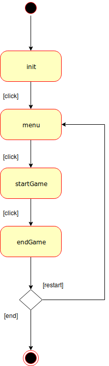

# AppMobile-PWA : Retro Shooter

This project was realized by Bourguignon Maxime and Simon Christophe.

## Introduction

For the mobile applications course (AM4L), we had to make a retro shooter. Two choices were possible:

- A native Android App;
- A Progressive Web App.

For challenge and discovery, we opted for the PWA.

## Game

The link to play to our funniest and most enjoyable retro shooter game is:\
https://retro-shooter-am4l-v2.firebaseapp.com/

### How to play

Tux follows your finger or your mouse (if you play on a computer).\
To shoot, you must keep your finger (or mouse) down. You earn 10 points for each enemy you eliminate.

After you died (hit by a droppings or feline), you can save your score and hope to be in the player's top five by setting your trigram on the displayed letters.

### Application principles

The game has four states: init, menu, startGame and endGame.

State diagram UML

#### init state

This state is a preview page to receive an immersive introduction to the game.
When you click on it, you go to the next state, the menu.

#### menu state

This state shows the high scores. We load the five highest scores in the game's database.
When you're ready, you can click on the page to play, the startGame state.

#### startGame state

This state is the playable state.
Enemies pop recursively and shoot at a rate depending on your current score.

When you hit an enemy or enemy's droppings, you die and go to the endGame state.

#### endGame state

This state is the end state.
You can see the score of your game. You need to set your trigram to save your score in the database.

## Development

### Deployment

### Libraries and dependencies

To develop our PWA retro shooter, we configured a database with firebase and we used a framework to have game's physics called wade.

## Firebase

## Wade

Wade is a framework to develop game in javascript. It has a library to create elements and manipulate them easily.

### Credits

the images come from wikipedia, imgur, pngtree, pixabay.\
the sounds come from soundbible.\
the documentation and the tutorials for wade come from clockworkchilli.
